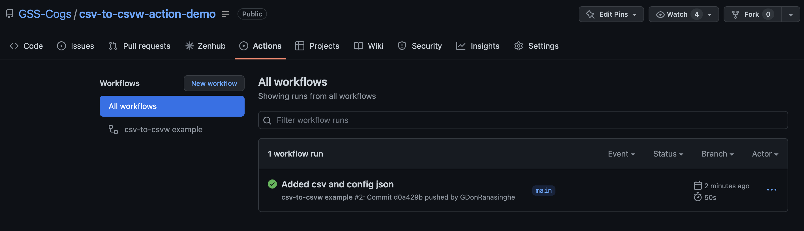
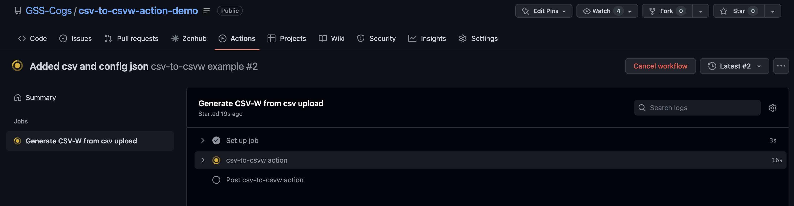
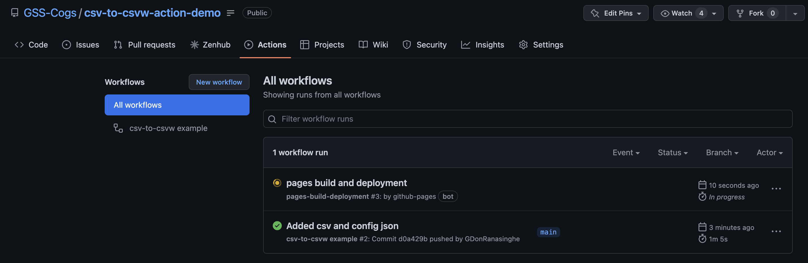
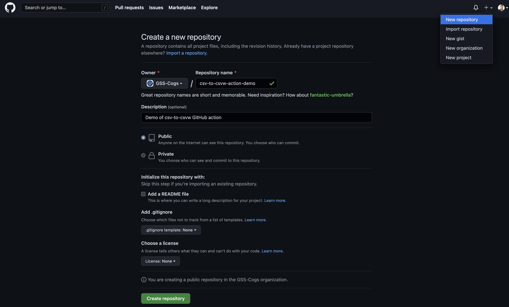
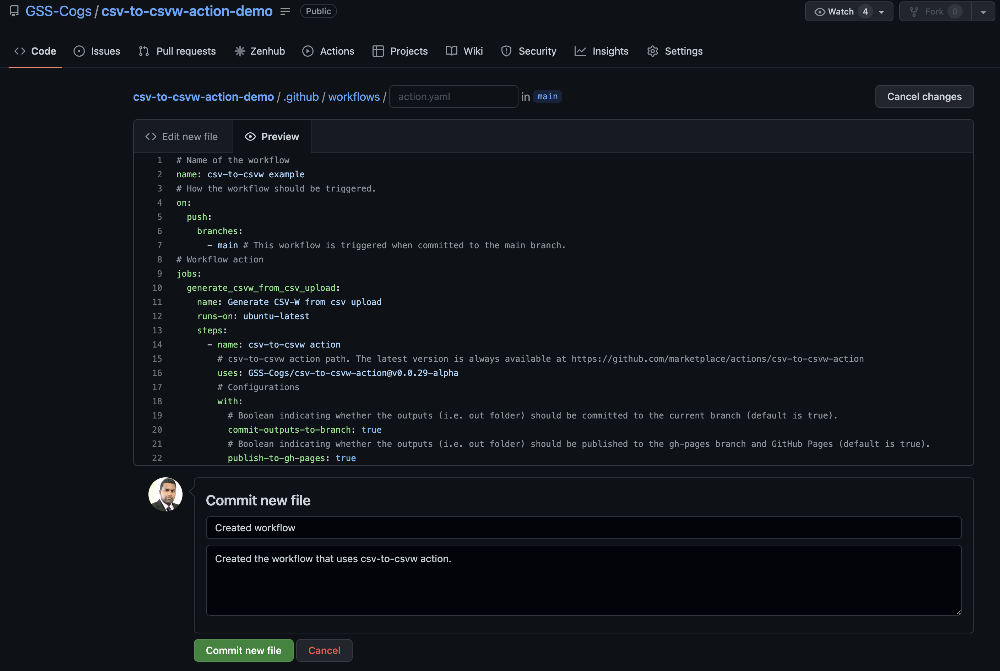
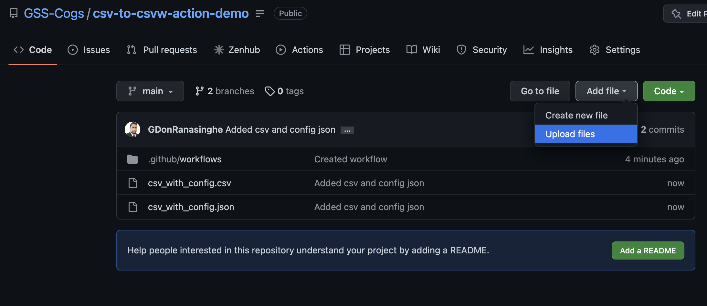
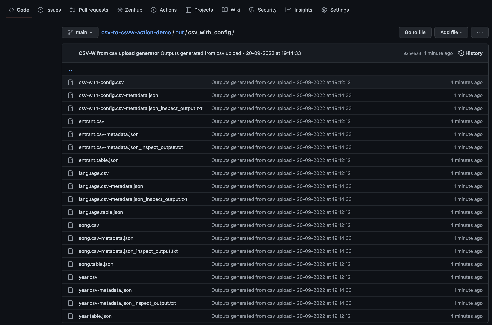
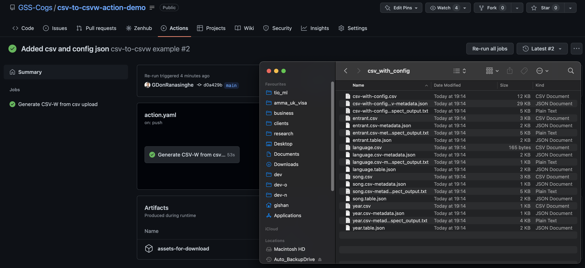
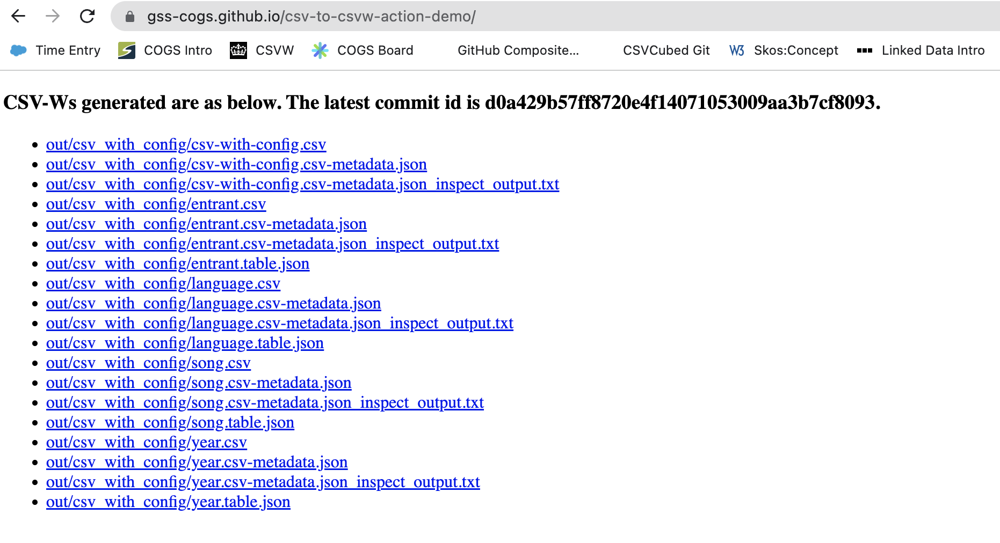

# Build with csv-to-csv-w GitHub action

The [csv-to-csvw GitHub action](https://github.com/marketplace/actions/csv-to-csvw-action) enables you to build CSV-Ws by pushing CSV and [qube-config.json](https://gss-cogs.github.io/csvcubed-docs/external/guides/configuration/qube-config/) files to a Git repository configured with [Github Actions](https://docs.github.com/en/actions). It is designed to bring csvcubed to users who have difficulty installing software in corporate environments, or for those who want to keep a versioned history of their publications.

For information on how to install csvcubed locally, take a look at the [installation quick start](https://gss-cogs.github.io/csvcubed-docs/external/quick-start/installation/).

The remainder of this guide walks you through how to prepare the inputs, how the csv-to-csvw GitHub action works, and then guides you through how to [use the action](#using-the-action) on your own GitHub repository to convert CSV inputs into CSV-Ws.

## Inputs 

The action expects the user to organise the inputs as follows:

* The CSV files and their configuration JSONs can be at any location inside the repository which isn't inside a top-level folder called `out`. The `out` folder is reserved for storing the outputs produced by the action.
* If a CSV file has a configuration JSON, the filename of the configuration JSON needs to match the filename of the CSV file. And both files need to be stored at the same location. For example, `csv/my_data.csv` and `csv/my_data.json`.


## Build process

In this section, an introduction to the key steps performed by the action is provided.

The action script can be observed in the [csv-to-csvw-action repository](https://github.com/GSS-Cogs/csv-to-csvw-action). An example repository a user would create to use the action can be observed in the [csv-to-csvw-example repository](https://github.com/GSS-Cogs/csv-to-csvw-action-example).

### 1. Triggering the job

The action is triggered when a user adds, edits or deletes a CSV or JSON configuration file in the repository. A user can commit these files in any preferred folder structure, including committing to the root of the repository. An example set of files committed to the repository with various folder structures is available [here](https://github.com/GSS-Cogs/csv-to-csvw-action-example).

>NOTE: committing files to the `out` folder at the root of the repository will not trigger the action. This folder is reserved for storing the outputs produced by the action.

### 2. Building and inspecting CSV-Ws

On a new commit, the action runs the [`csvcubed build`](https://gss-cogs.github.io/csvcubed-docs/external/guides/command-line/build-command/)command on any CSV and accompanying JSON files which have been changed. The CSV-Ws output by this command are saved as [outputs](#3-producing-outputs) by the action. 

The [`csvcubed inspect`](https://gss-cogs.github.io/csvcubed-docs/external/guides/command-line/inspect-command/) command is then run on all new or updated CSV-Ws; the output is then saved in an `inspect_output.txt` file next to each CSV-W output. For example, for the CSV-W at `out/my_folder/my_data/my_data.csv-metadata.json` a file, containing the [`csvcubed inspect`](https://gss-cogs.github.io/csvcubed-docs/external/guides/command-line/inspect-command/) command output, named `out/my_folder/my_data/my_data.csv-metadata.json_inspect_output.txt` is created.

The progress of the action can be observed by going to the `Actions` section in the GitHub web console.

A more detailed view of the progress of the action can be seen by clicking on the action.


If you have chosen to publish outputs to [GitHub Pages](#github-pages), an action called `pages build and deployment` will be triggered when the csv-to-csvw finishes. This action is responsible for deploying the outputs to GitHub Pages.


### 3. Producing outputs

#### GitHub artifacts

The action always publishes CSV-Ws and inspect command outputs as build artifacts. A user can download a zip file consisting of the CSV-Ws and inspect command outputs from the artifacts section within the GitHub action run. More information on how to download the artifacts is available in the GitHub guide on [How to Download GitHub Action Artifacts](https://docs.github.com/en/actions/managing-workflow-runs/downloading-workflow-artifacts).

#### Committing outputs to `out` folder

If csv-to-csvw's `commit-outputs-to-branch` configuration parameter is set to `true`, the action commits the outputs to a folder called `out` in the root of the current branch upon completion. This helps to maintain a history of the outputs produced.

#### GitHub Pages

If csv-to-csvw's `publish-to-gh-pages` configuration parameter is set to `true`, the action publishes the CSV-Ws and inspect command outputs to [GitHub Pages](https://pages.github.com/)' static file hosting. The action generates an `index.html` page listing the CSV-W outputs. The URL to access the GitHub page is provided in GitHub Pages setting of the repository which is discussed in the [Using the action](#using-the-action) section below.

## Using the action

To use the csv-to-csvw GitHub action,

1. Ensure that you [created](https://github.com/signup) and/or [logged into](https://github.com/login) your GitHub user account.

2. (Optional) Create a new repository and give it a name.

    >NOTE: If you would like to use the csv-to-csvw action in an existing repository, you can skip this step.
    
    It's important to consider the costs of running GitHub Actions when you set up your repository. At the time of writing, public repositories can make use of GitHub Actions at no cost, however, private repositories have to pay after reaching the limit of [2000 minutes per month](https://github.com/pricing).

    

3. Create a new file with extension `.yaml` (i.e. an YAML file) under the `.github/workflows` folder and give it a name (e.g. action.yaml). Then add the below content into it and commit the file.

    > NOTE: If you would like to integrate the csv-to-csvw action into an existing GitHub action workflow, you can do so by adding the entire `generate_csvw_from_csv_upload` job or the `csv-to-csvw action` step into the existing workflow file.

    > NOTE: Read the comments in below content to learn more about the supported configurations.

    ```YAML
    # Name of the workflow
    name: csv-to-csvw example
    # How the workflow should be triggered.
    on:
    push:
        branches:
        - main # This workflow is triggered when committed to the main branch.
    # Workflow action
    jobs:
    generate_csvw_from_csv_upload:
        name: Generate CSV-W from csv upload # generate_csvw_from_csv_upload job
        runs-on: ubuntu-latest
        steps:
        - name: csv-to-csvw action # csv-to-csvw action step
            # csv-to-csvw action path. The latest version is always available at https://github.com/marketplace/actions/csv-to-csvw-action
            uses: GSS-Cogs/csv-to-csvw-action@v0.0.29-alpha
            # Configurations
            with:
            # Boolean indicating whether the outputs (i.e. out folder) should be committed to the current branch (default is true).
            commit-outputs-to-branch: true
            # Boolean indicating whether the outputs (i.e. out folder) should be published to the gh-pages branch and GitHub Pages (default is true).
            publish-to-gh-pages: true
            # File paths which csv-to-csvw should avoid converting into CSV-Ws
            paths-to-exclude: |
                # This will ignore all files immediately in the `ignore` directory.
                ignore/*
                # This will recursively ignore all files in any subfolders of the `ignore` directory.
                ignore/**/*
            # (WARNING: Advanced Configuration) Boolean indicating whether to only convert CSV files which have a companion JSON configuration file into CSV-Ws.
            config-required: false
            # (WARNING: Advanced Configuration) Boolean indicating whether to output debug statements in order to help diagnose a fault or unexpected behaviour.
            debug: false
    ```

    

    Make sure to configure the [`commit-outputs-to-branch`](#committing-outputs-to-out-folder) and [`publish-to-gh-pages`](#github-pages) configuration parameters to specify where you want the build outputs to be published.

4. (Optional) If you configured the csv-to-csvw action to publish to GitHub Pages, then be sure to create a new branch called `gh-pages`. Then go to the repository's settings and set the branch for GitHub Pages - under the `Source` section, set the `Branch` to `gh-pages` and set the folder location to `/(root)`. Also, keep a note of the URL at which your GitHub Pages site is published at.

    

5. Now that the repository is created and the GitHub Pages setting is configured, you can commit and push your inputs using the GitHub web console. Once the inputs are committed, as discussed in the [Build Process](#build-process) section, observe the progress of the action and wait for it to complete.


### Observing the outputs

Now we are ready to explore the outputs produced by the action. First look at the `out` folder within the repository. The `out` folder now consists of the CSV-Ws and inspect command logs generated for inputs committed to the repository.

>NOTE: If you are using the GitHub Desktop Client or the Github Command Line Interface, make sure to run `git pull` beforehand.



Then download the artifacts produced by the GitHub action. The downloaded folder consists of the CSV-Ws and inspect command logs.


Finally, open the GitHub Pages URL (noted in Step 2 of the previous section) in the preferred web browser. A web page with all the outputs listed with downloadable links will appear in the browser.


## Reporting issues

If you have encountered any issues when using the csv-to-csvw action, please raise them at our [Csv-to-csvw Action Issues Page](https://github.com/GSS-Cogs/csv-to-csvw-action/issues).